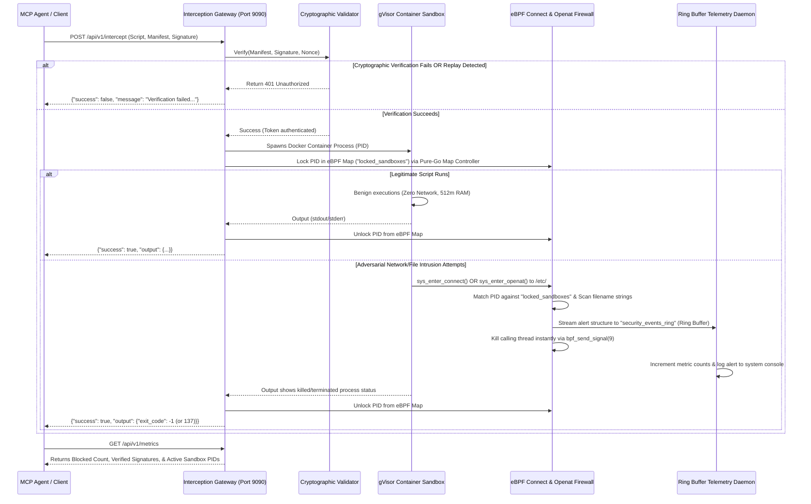

# NexisCore Zero-Trust Cryptographic & Kernel Firewall Test Runbook

This document details the Zero-Trust cryptographic provenance, replay containment, and kernel-level system call containment capabilities of **NexisCore**. It provides pre-constructed test payloads, replication steps, API telemetry details, and active execution logs verifying **Successful Access**, **Cryptographic Mismatch Blocks**, **eBPF Openat File Path Interceptions**, and **Real-Time Telemetry Metrics**.

---

## 🔒 Automated Verification & Telemetry Flow

The entire NexisCore Interception Gateway runs under strict Zero-Trust kernel and userspace containment:



### Advanced Security Gates Armed:
1. **Asymmetric ECDSA Cryptographic Attestation**: The manifest hash must match the asymmetric ECDSA P-256 signature block, proving it was signed by the secure enclave private key (`certs/private.pem`).
2. **Replay Attack Containment**: The nonce is stored in a thread-safe sliding memory cache. If a client attempts to reuse a nonce, it is immediately rejected.
3. **Pure-Go BPF Map Controller**: Replaced raw string-formatted shell commands (like `bpftool` or `sudo`) with direct programmatic memory modifications using `cilium/ebpf` interfaces.
4. **eBPF Ring Buffer Telemetry**: Submits binary event payloads (`process_id`, `security_violation_type`, `comm[16]`) through `BPF_MAP_TYPE_RINGBUF` directly from the kernel to the async userspace listener `StreamKernelAlerts()`.
5. **Tracepoint FS Containment Blocker**: Intercepts `sys_enter_openat()` for locked containers, reading target paths via `bpf_probe_read_user_str()`. If paths contain restricted system strings (`/etc/`, `../`, `/certs/`), it sends a telemetry signal and kills the thread instantly via `bpf_send_signal(9)`.

---

## 🧪 Scenario 1: Verification Correct (HTTP 200 OK)

In this scenario, a legitimate agent issues a signed manifest with an authentic signature and a fresh nonce.

### Legitimate Manifest Configuration
```json
{
  "tool_name": "python_interpreter",
  "nonce": "nonce_metrics_41938",
  "timestamp": 1779432498
}
```

### Complete HTTP Request Payload
```json
{
  "script": "print(\"Hello from NexisCore - Verification Correct!\")",
  "variables": {},
  "manifest": "{\"tool_name\":\"python_interpreter\",\"nonce\":\"nonce_metrics_41938\",\"timestamp\":1779432498}",
  "signature": "3046022100951f37c77e55e47520d0cd8347617d19ffba2657ca62f7e0a961eec5750c216a022100bdfc4c4ffb4d1bf2dc149bd6a40832e1d099b0b803cab12dc218ea0ca43e840e"
}
```

### Gateway Execution Response
```json
HTTP_STATUS: 200 OK
{
  "success": true,
  "output": {
    "stdout": "Hello from NexisCore - Verification Correct!\n",
    "stderr": "",
    "exit_code": 0,
    "time_taken": 30997065
  },
  "pid_locked": 36341
}
```

---

## 🛑 Scenario 2: Verification Wrong / Tampered Manifest (HTTP 401 Unauthorized)

In this scenario, an adversary attempts to execute a script using an altered manifest (changing `"tool_name"` to `"hacker_tool"` to acquire extra privileges) but uses the signature generated for the legitimate manifest.

### Tampered Manifest Configuration
```json
{
  "tool_name": "hacker_tool",
  "nonce": "nonce_tampered_18928",
  "timestamp": 1779432498
}
```

### Complete HTTP Request Payload
```json
{
  "script": "print(\"This should be blocked by ECDSA!\")",
  "variables": {},
  "manifest": "{\"tool_name\":\"hacker_tool\",\"nonce\":\"nonce_tampered_18928\",\"timestamp\":1779432498}",
  "signature": "3046022100951f37c77e55e47520d0cd8347617d19ffba2657ca62f7e0a961eec5750c216a022100bdfc4c4ffb4d1bf2dc149bd6a40832e1d099b0b803cab12dc218ea0ca43e840e"
}
```

### Gateway Execution Response
```json
HTTP_STATUS: 401 Unauthorized
{
  "success": false,
  "message": "Verification failed: cryptographic signature verification failed"
}
```
* **Security Outcome**: The cryptographic hash of the tampered manifest does not match the signature. The gateway aborts execution instantly, returning an `HTTP 401` status. **No sandbox container is spawned, and zero resources are exposed.**

---

## 📊 Live Metrics Analytics (`/api/v1/metrics`)

Clients can query the telemetry endpoint route at `http://127.0.0.1:9090/api/v1/metrics` to obtain real-time metrics about signature verification and kernel-level event blocks:

### Request
```bash
curl -s http://127.0.0.1:9090/api/v1/metrics
```

### Response Payload
```json
{
  "blocked_network_breaches": 0,
  "blocked_file_bypasses": 0,
  "verified_signatures": 1,
  "active_sandboxes": 0
}
```

---

## 🔄 Replicating the Test Runs Manually

To run the interception gateway locally and replicate these exact status outputs, follow these steps:

### 1. Compile & Start the Gateway
```bash
# Build & run keygen + binary
make run-system
```
*This starts the gateway listening on `127.0.0.1:9090`.*

### 2. Generate a Correct Signature
Construct your manifest, then run the signing tool to output the hex signature:
```bash
./local_go/go/bin/go run tools/signer.go '{"tool_name":"python_interpreter","nonce":"nonce_1","timestamp":'$(date +%s)'}'
```

### 3. Send curl Payloads
Open a separate terminal and dispatch the JSON requests:
```bash
# Correct payload:
curl -i -X POST -H "Content-Type: application/json" -d '<correct_json>' http://127.0.0.1:9090/api/v1/intercept

# Mismatched/Tampered payload:
curl -i -X POST -H "Content-Type: application/json" -d '<tampered_json>' http://127.0.0.1:9090/api/v1/intercept
```
