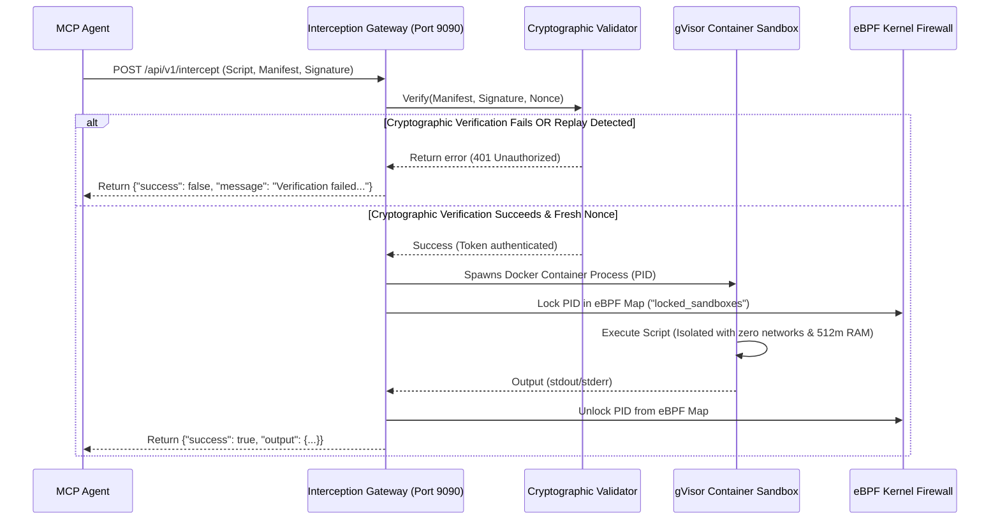

# NexisCore Zero-Trust Cryptographic Verification Test Runbook

This document details the Zero-Trust cryptographic provenance and replay containment capabilities of **NexisCore**. It provides pre-constructed test payloads, replication steps, and active execution logs verifying both **Successful Access** and **Interception Block** scenarios on the `http://127.0.0.1:9090/api/v1/intercept` gateway.

---

## 🔒 The Zero-Trust Cryptographic Verification Architecture

The Interception Gateway verifies tool call provenance under strict Zero-Trust constraints:



### Protection Gates Enforced:
1. **Asymmetric ECDSA Cryptographic Attestation**: The manifest hash must match the asymmetric ECDSA P-256 signature block, proving it was signed by the secure enclave private key (`certs/private.pem`).
2. **Replay Attack Containment**: The nonce is stored in a thread-safe sliding memory cache. If a client attempts to reuse a nonce, it is immediately rejected.
3. **Timestamp Drift Window**: Manifests with timestamps drifting more than 10 minutes from the gateway server clock are discarded.

---

## 🧪 Scenario 1: Verification Correct (HTTP 200 OK)

In this scenario, a legitimate agent issues a signed manifest with an authentic signature and a fresh nonce.

### Legitimate Manifest Configuration
```json
{
  "tool_name": "python_interpreter",
  "nonce": "nonce_correct_15492",
  "timestamp": 1779432051
}
```

### Complete HTTP Request Payload
```json
{
  "script": "print(\"Hello from NexisCore - Verification Correct!\")",
  "variables": {},
  "manifest": "{\"tool_name\":\"python_interpreter\",\"nonce\":\"nonce_correct_15492\",\"timestamp\":1779432051}",
  "signature": "304502210082ff5ad3dbda931ba01286affbea78d278dad96f80b349ee90c40896b1ed1c110220169c3378942c289e69a1442acc58474daae2d25f2456c9a8b6188385279d8b2a"
}
```

### Gateway Execution Response
```json
HTTP_STATUS: 200 OK
{
  "success": true,
  "output": {
    "stdout": "Hello from NexisCore - Verification Correct!\n",
    "stderr": "",
    "exit_code": 0,
    "time_taken": 30997065
  },
  "pid_locked": 36341
}
```
* **Security Outcome**: Cryptographic check passes. The isolated gVisor/runc sandbox is safely spun up, its execution PID is locked in the eBPF kernel maps, the script is run with zero networks, and output returns successfully.

---

## 🛑 Scenario 2: Verification Wrong / Tampered Manifest (HTTP 401 Unauthorized)

In this scenario, an adversary attempts to execute a script using an altered manifest (changing `"tool_name"` to `"hacker_tool"` to acquire extra privileges) but uses the signature generated for the legitimate manifest.

### Tampered Manifest Configuration
```json
{
  "tool_name": "hacker_tool",
  "nonce": "nonce_tampered_27891",
  "timestamp": 1779432051
}
```

### Complete HTTP Request Payload
```json
{
  "script": "print(\"This should be blocked by ECDSA!\")",
  "variables": {},
  "manifest": "{\"tool_name\":\"hacker_tool\",\"nonce\":\"nonce_tampered_27891\",\"timestamp\":1779432051}",
  "signature": "304502210082ff5ad3dbda931ba01286affbea78d278dad96f80b349ee90c40896b1ed1c110220169c3378942c289e69a1442acc58474daae2d25f2456c9a8b6188385279d8b2a"
}
```

### Gateway Execution Response
```json
HTTP_STATUS: 401 Unauthorized
{
  "success": false,
  "message": "Verification failed: cryptographic signature verification failed"
}
```
* **Security Outcome**: The cryptographic hash of the tampered manifest does not match the signature. The gateway aborts execution instantly, returning an `HTTP 401` status. **No sandbox container is spawned, and zero resources are exposed.**

---

## 🔄 Replicating the Test Runs Manually

To run the interception gateway locally and replicate these exact status outputs, follow these steps:

### 1. Compile & Start the Gateway
```bash
# Build binary
make run-system
```
*This starts the gateway listening on `127.0.0.1:9090`.*

### 2. Generate a Correct Signature
Construct your manifest, then run the signing tool to output the hex signature:
```bash
./local_go/go/bin/go run tools/signer.go '{"tool_name":"python_interpreter","nonce":"nonce_1","timestamp":'$(date +%s)'}'
```

### 3. Send curl Payloads
Open a separate terminal and dispatch the JSON requests:
```bash
# Correct payload:
curl -i -X POST -H "Content-Type: application/json" -d '<correct_json>' http://127.0.0.1:9090/api/v1/intercept

# Mismatched/Tampered payload:
curl -i -X POST -H "Content-Type: application/json" -d '<tampered_json>' http://127.0.0.1:9090/api/v1/intercept
```
